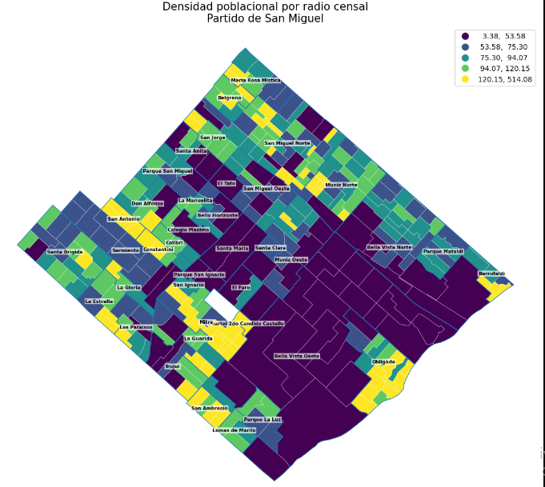
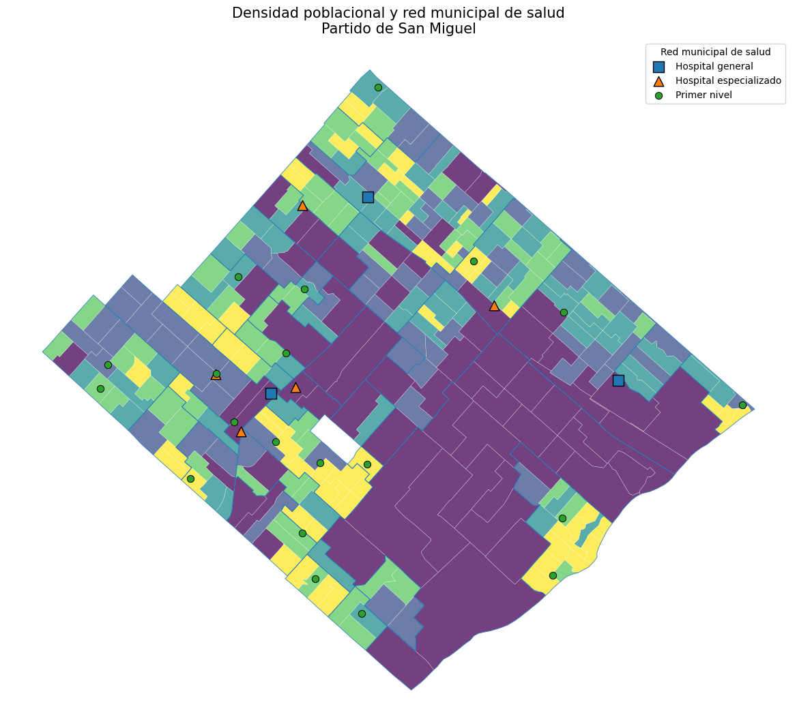
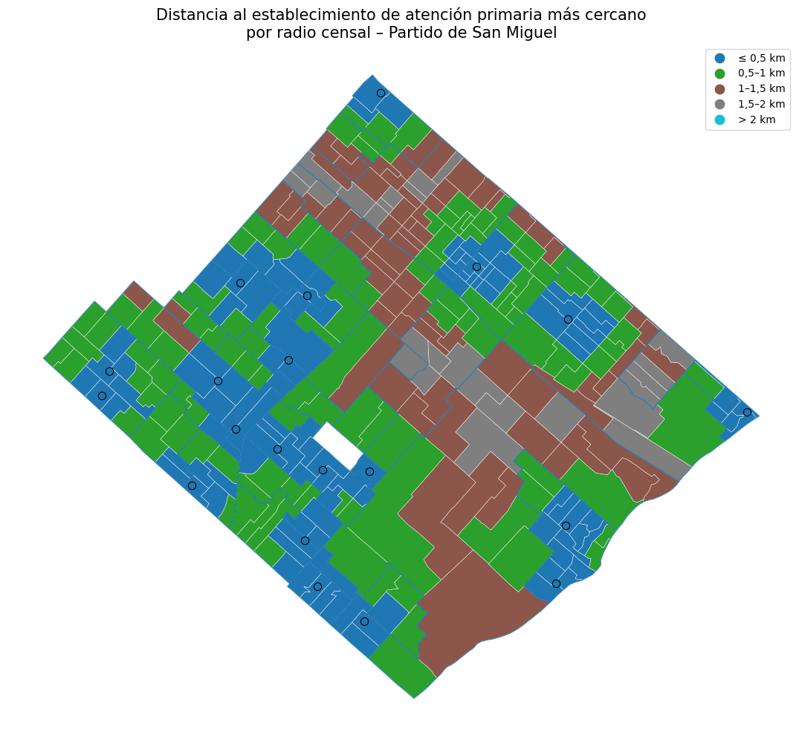
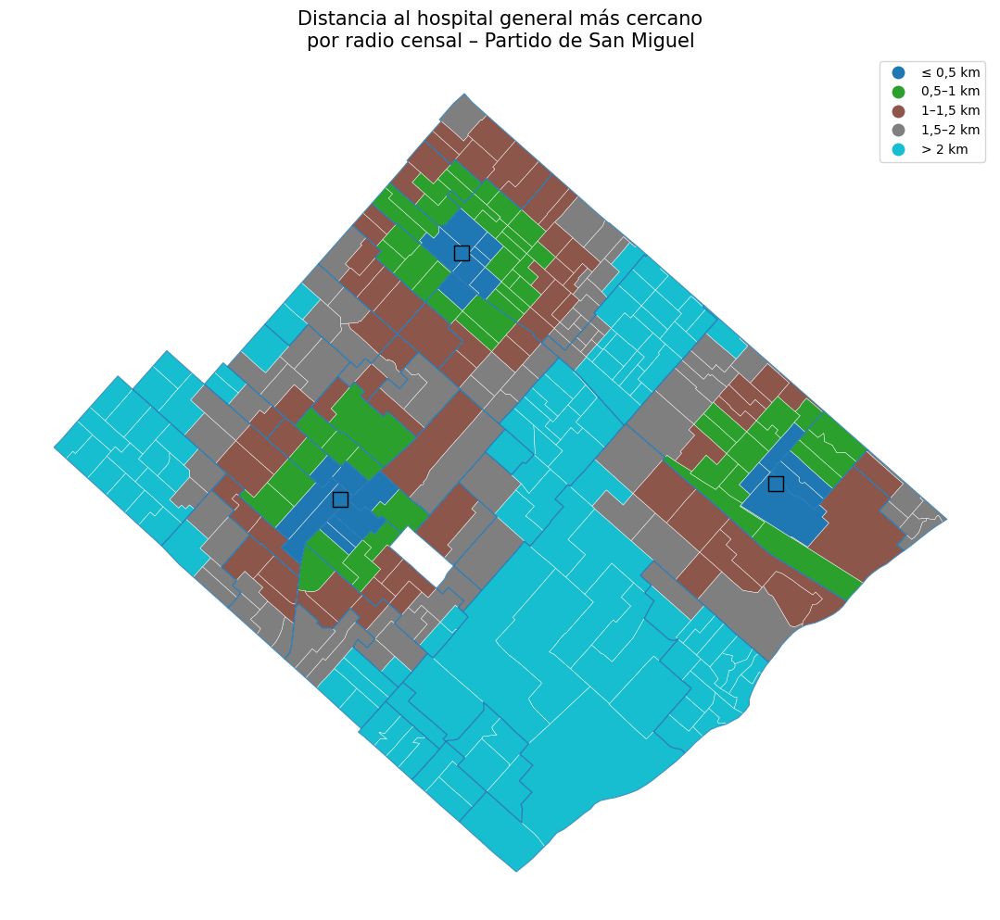
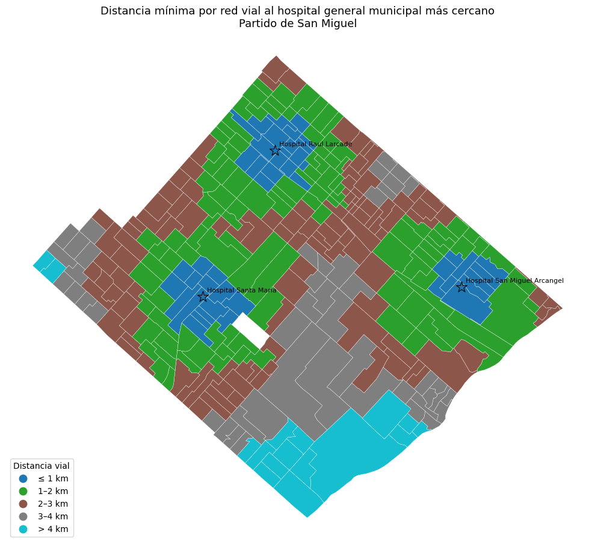
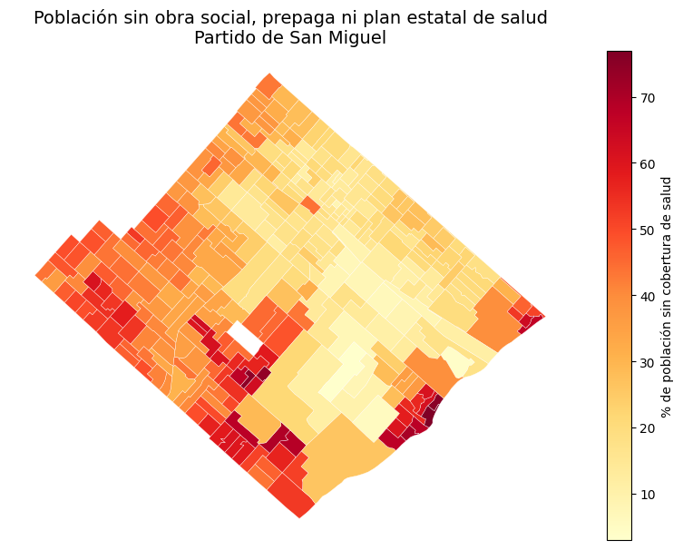
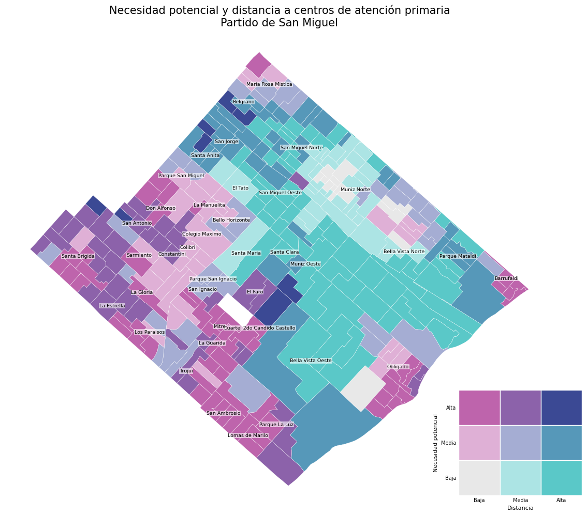
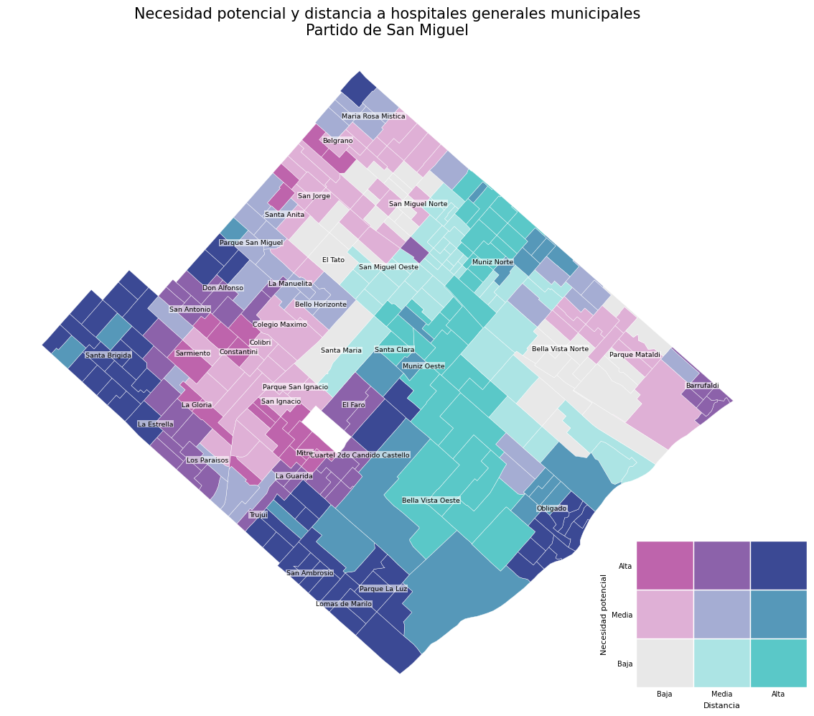

# Accesibilidad territorial a los servicios de salud de San Miguel
Análisis geoespacial de la proximidad de la población del partido de San Miguel (Buenos Aires, Argentina) a la red municipal de salud, combinando distancias euclídeas, distancias por red vial y una aproximación a la necesidad potencial de uso del sistema público.

Año de referencia de los datos: Censo 2022
Fecha de realización: octubre de 2026

## Pregunta principal
¿Qué tan accesible es territorialmente la red municipal de salud para la población de San Miguel y qué áreas presentan menor proximidad relativa a los establecimientos sanitarios?
El objetivo es identificar diferencias territoriales en la proximidad a la red municipal de salud y detectar áreas que podrían requerir un análisis prioritario desde la gestión.

## Contenido

- [Resumen de hallazgos](#-resumen-de-hallazgos)
- [Datos](#-datos)
- [Metodología](#-metodología)
- [Resultados](#-resultados)
  - [1. Proximidad en línea recta](#1-proximidad-en-línea-recta-distancia-euclídea)
  - [2. Proximidad por red vial](#2-proximidad-por-red-vial)
  - [3. Cobertura de salud y necesidad potencial](#3-cobertura-de-salud-y-necesidad-potencial)
- [Conclusiones](#-conclusiones)
- [Limitaciones](#-limitaciones)
- [Próximos pasos](#-próximos-pasos)
- [Fuentes](#-fuentes)

## Resumen de hallazgos

| Indicador | Valor |
|---|---|
| Radios censales analizados | **326** (99,52% de la población) |
| Población analizada | **326.091** habitantes |
| Población ≤ 1 km (línea recta) de atención primaria | **74,6%** |
| Población ≤ 1 km (línea recta) de hospital general | **20,1%** |
| Distancia vial media a hospital general | **2,15 km** (vs. 1,68 km euclídea) |
| Distancia vial máxima a hospital general | **10,37 km** (vs. 4,60 km euclídea) |
| Población a ≤ 2 km por red vial de atención primaria | **94,9%** |
| Población sin obra social, prepaga ni plan estatal | **116.826 (35,83%)** |

## Datos

| Fuente | Uso |
|---|---|
| Geoportal de la Municipalidad de San Miguel | Ubicación de establecimientos de salud y capas de radios censales |
| Censo Nacional de Población, Hogares y Viviendas 2022 (INDEC) | Población por radio censal |
| REDATAM – Censo 2022 | Cobertura de salud por radio censal |
| OpenStreetMap (vía OSMnx) | Red vial apta para circulación vehicular |

### Archivos utilizados.
El análisis combina información proveniente de distintas bases de datos:

- **`radios2022_envejecimiento.gpkg`**: base geoespacial con información demográfica del Censo 2022 a nivel de radio censal. Se filtraron los registros correspondientes al partido de San Miguel y se utilizaron principalmente las variables de población y densidad poblacional. Disponible para su descarga en este link: https://rdu.unc.edu.ar/bitstreams/5e626c56-1af8-4ab8-91a4-afbe9917595d/download 

- **`radios_san_miguel.geojson`**: capa de radios censales obtenida del Geoportal de la Municipalidad de San Miguel. Se utilizó para incorporar la identificación de los barrios y complementar la información territorial de cada radio censal. (Disponible en este repositorio, carpeta "datos")

- **`cobertura_salud.xlsx`**: extracción realizada mediante REDATAM a partir del Censo 2022. El archivo original contiene información de cobertura de salud por radio censal para múltiples partidos. Los radios correspondientes al partido de San Miguel fueron identificados mediante su código geográfico, cuyo prefijo es **`06760`**, y posteriormente filtrados y procesados en Python. Se identificaron 328 radios censales correspondientes al partido. (Disponible en este repositorio, carpeta "datos")

Las distintas bases fueron vinculadas mediante los códigos de radio censal (`CRO` / `clave`). Para el análisis espacial conjunto se utilizaron **326 radios censales**, equivalentes al **99,52% de la población considerada**. Campo de Mayo y Macabi fueron excluidos por no estar presentes en la base geoespacial utilizada.

La red vial utilizada para calcular las distancias por caminos se obtuvo directamente de **OpenStreetMap mediante OSMnx**, por lo que no corresponde a un archivo almacenado originalmente en la carpeta de datos.

### Establecimientos considerados

| Tipo | Cantidad | Ejemplos |
|---|---|---|
| Hospitales generales | 3 | Raúl Larcade, San Miguel Arcángel, Santa María |
| Primer nivel (centros de salud, CIC, La Posta) | 20 | Centro de Salud 20 de Julio, Ramón Carrillo, UFO, etc. |
| Hospitales especializados | 5 | Hospital Oftalmológico Mons. Barbich, Salud Mental (Hospital de Día), NET, etc. |

Ver listado completo de establecimientos

| Nombre | Tipo |
|---|---|
| Hospital Raúl Larcade | Hospital general |
| Hospital San Miguel Arcángel | Hospital general |
| Hospital Santa María | Hospital general |
| Centro Integrador Comunitario (C.I.C.) María Lobato | Primer nivel |
| Centro de Salud 20 de Julio | Primer nivel |
| Centro de Salud 29 de Septiembre | Primer nivel |
| Centro de Salud Ana Teresa Barthalot (ex Bella Vista Norte) | Primer nivel |
| Centro de Salud Camila Rolón | Primer nivel |
| Centro de Salud Cándido Castelló | Primer nivel |
| Centro de Salud Cura Brochero (ex 17 de Agosto) | Primer nivel |
| Centro de Salud Dr. Alberto Sabin (ex Los Paraísos) | Primer nivel |
| Centro de Salud Dr. Federico Leloir (Barrio Obligado) | Primer nivel |
| Centro de Salud Dr. Luis Suárez Paris | Primer nivel |
| Centro de Salud Dr. Raúl Matera (ex Lomas de Mariló) | Primer nivel |
| Centro de Salud Dr. René Favaloro (ex Trujui) | Primer nivel |
| Centro de Salud Dra. Marta Antoniazzi | Primer nivel |
| Centro de Salud Padre Mora | Primer nivel |
| Centro de Salud Pte. Perón | Primer nivel |
| Centro de Salud Ramón Carrillo | Primer nivel |
| Centro de Salud Rodolfo Podestá | Primer nivel |
| Centro de Salud San Miguel Oeste | Primer nivel |
| Centro de Salud UFO | Primer nivel |
| La Posta | Primer nivel |
| Centro de Intervención Temprana | Hospital especializado |
| Hospital Oftalmológico Municipal Mons. Barbich | Hospital especializado |
| Hospital Oftalmológico y Odontológico Central de San Miguel | Hospital especializado |
| Hospital de Día Salud Mental | Hospital especializado |
| Nunca es Tarde (NET) | Hospital especializado |

> Los análisis comparan **atención primaria** vs. **hospitales generales** por separado, ya que cumplen funciones distintas dentro del sistema sanitario.

## Metodología

1. **Integración de datos**: establecimientos georreferenciados + población por radio censal (Censo 2022).
2. **Punto representativo**: cada uno de los 326 radios censales se representa con un punto interior de su polígono.
3. **Distancia euclídea** al establecimiento más cercano, por tipo (primer nivel / hospital general).
4. **Distancia media ponderada por población**, para que los radios más poblados pesen más en el indicador agregado.
5. **Distancia por red vial** con [OSMnx](https://github.com/gboeing/osmnx):
   - Buffer de **5 km** alrededor del límite del partido, para evitar cortes artificiales de recorridos.
   - Descarga del grafo vial apto para circulación vehicular.
   - Asociación de radios y establecimientos al nodo más cercano.
   - Ruta de menor distancia a cada hospital general; se conserva la mínima.
6. **Cobertura de salud** (REDATAM): % de población sin obra social, prepaga ni plan estatal, como indicador de **necesidad potencial** de uso del sistema público.
7. **Mapas bivariados**: necesidad potencial × distancia vial, clasificadas en **terciles** (categorías relativas, no normativas).
8. **Correlación de Spearman** entre necesidad potencial y distancia vial.

### Exclusión de radios

REDATAM identifica 328 radios; **Campo de Mayo** y **Macabi** no están en la capa geoespacial de 326 radios. Además, Campo de Mayo tiene una extensión muy superior a la de los radios urbanos, por lo que un único punto representativo sesgaría la estimación de distancia.

## Resultados

### Distribución territorial de la población

Como punto de partida, se analizó la distribución de la población dentro del partido de San Miguel. La densidad poblacional presenta una marcada heterogeneidad territorial entre los radios censales, por lo que considerar únicamente la localización de los establecimientos de salud no permite caracterizar adecuadamente la proximidad de la población a la oferta sanitaria.

La siguiente figura muestra la densidad poblacional por radio censal, expresada en habitantes por hectárea.

Figura 1. Densidad poblacional por radio censal en el partido de San Miguel. 

Fuente: elaboración propia sobre la base del Censo Nacional de Población, Hogares y Viviendas 2022 y cartografía del Geoportal de la Municipalidad de San Miguel.

### Población y red municipal de salud

La población y los establecimientos sanitarios no se distribuyen homogéneamente dentro del partido. Para analizar esta configuración territorial, se combinaron los radios censales y su densidad poblacional con la localización de los establecimientos de la red municipal de salud. Se integró información georreferenciada de establecimientos sanitarios proveniente del Geoportal de la Municipalidad de San Miguel con información demográfica a nivel de radio censal.

Figura 2. Densidad población por hectárea y red municipal de salud. 

Fuente: elaboración propia a partir del Censo 2022 y del Geoportal de la Municipalidad de San Miguel.

### 1. Proximidad en línea recta (distancia euclídea)

Para cada radio se utilizó un punto representativo de su geometría y se calculó la distancia euclídea al establecimiento sanitario más cercano. Los establecimientos se analizaron separadamente según correspondieran a atención de primer nivel u hospitales generales.
Adicionalmente, se calculó una distancia media ponderada por la población de cada radio censal, de manera que las áreas con mayor población tuvieran una incidencia proporcionalmente mayor en el indicador agregado.
Las distancias representan una aproximación a la accesibilidad geográfica y no equivalen a tiempos efectivos de viaje. Tampoco incorporan, en esta etapa, características como disponibilidad de turnos, capacidad, personal médico, horarios, transporte público o barreras físicas.

**Tabla 2. Indicadores de proximidad territorial**

| Indicador | Primer nivel | Hospitales generales |
|---|---|---|
| Distancia media por radio | 0,77 km | 1,68 km |
| Distancia mediana | 0,71 km | 1,64 km |
| Percentil 25 | 0,40 km | 1,12 km |
| Percentil 75 | 1,10 km | 2,17 km |
| Distancia máxima | 1,81 km | 4,60 km |
| Media ponderada por población | 0,73 km | 1,75 km |

Fuente: elaboración propia sobre la base de datos del Geoportal de la Municipalidad de San Miguel y datos poblacionales del Censo Nacional 2022.
Nota: ante la ausencia de información sobre la localización exacta de la población dentro de cada radio censal, se utilizó un punto interior representativo de cada polígono para el cálculo de las distancias. Por lo tanto, los resultados deben interpretarse como indicadores aproximados de proximidad territorial a nivel de radio censal y no como distancias individuales de los habitantes.

La distancia media ponderada por población al establecimiento de primer nivel más cercano fue de aproximadamente 0,73 km, mientras que para los hospitales generales alcanzó 1,75 km.
Asimismo, el 75% de los radios censales se encuentra a una distancia inferior a aproximadamente 1,10 km de un establecimiento de primer nivel. En el caso de los hospitales generales, ese valor asciende a 2,17 km. La mayor distancia observada fue de 1,81 km para atención primaria y 4,60 km para hospitales generales.

**Tabla 3. Población según proximidad**

| Distancia | Atención primaria | Hospitales generales |
|---|---|---|
| ≤ 0,5 km | 120.665 (37,0%) | 17.759 (5,4%) |
| ≤ 1,0 km | 243.221 (74,6%) | 65.518 (20,1%) |
| ≤ 1,5 km | 303.676 (93,1%) | 132.297 (40,6%) |
| ≤ 2,0 km | 326.091 (100,0%) | 210.580 (64,6%) |

**Fuente:** elaboración propia sobre la base del Geoportal de la Municipalidad de San Miguel y del Censo Nacional de Población, Hogares y Viviendas 2022 (INDEC).

- **74,6%** de la población analizada se encuentra en radios cuyo punto representativo está a ≤1 km de un establecimiento de atención primaria.
- Esa proporción alcanza el **93,1% a ≤1,5 km** y el **100% a ≤2 km**.
- Para los hospitales generales, solo el **20,1%** se encuentra a ≤1 km y el **64,6% a ≤2 km**.

La comparación muestra una diferencia territorial clara entre ambos niveles. La red de atención primaria presenta una mayor proximidad geográfica respecto de la distribución de la población, mientras que los hospitales generales presentan áreas de influencia territorialmente más extensas.

Esto no implica por sí mismo insuficiencia hospitalaria: los hospitales generales concentran prestaciones de mayor complejidad y cumplen una función diferente dentro de la red sanitaria.

Figura 3. Distancia al establecimiento de atención primaria más cercano. 

Fuente: elaboración propia sobre la base del Geoportal de la Municipalidad de San Miguel.

Figura 4. Distancia al hospital general municipal más cercano. 

Fuente: elaboración propia sobre la base del Geoportal de la Municipalidad de San Miguel.

Barrios con población en radios más alejados (línea recta)

**Tabla 4. Barrios con población a más de 2 km del hospital general más cercano**

| Barrio | Población >2 km | % del barrio | Distancia media |
|---|---|---|---|
| Lomas de Mariló | 4.579 | 100% | 3,81 km |
| Parque La Luz | 8.118 | 100% | 3,55 km |
| San Ambrosio | 5.976 | 100% | 3,10 km |
| Obligado | 18.671 | 96,7% | 2,53 km |
| Santa Brígida | 16.773 | 87,7% | 2,67 km |
| Muñiz Norte | 16.261 | 84,7% | 2,27 km |
| Muñiz Oeste | 10.169 | 79,4% | 2,34 km |
| Trujui | 5.131 | 64,9% | 2,37 km |
| Bella Vista Oeste | 12.539 | 57,7% | 2,95 km |

**Tabla 5. Barrios con población a más de 1,5 km del establecimiento de atención primaria más cercano**

| Barrio | Población >1,5 km | % del barrio | Distancia media |
|---|---|---|---|
| San Miguel Norte | 5.922 | 19,7% | 1,60 km |
| Parque Mataldi | 4.188 | 76,0% | 1,55 km |
| Bella Vista Oeste | 3.963 | 18,2% | 1,69 km |
| Muñiz Oeste | 3.015 | 23,5% | 1,57 km |
| San Jorge | 2.882 | 43,7% | 1,69 km |
| Bella Vista Norte | 1.529 | 6,7% | 1,65 km |
| Santa Clara | 916 | 100% | 1,81 km |

**Fuente:** elaboración propia sobre la base del Geoportal de la Municipalidad de San Miguel y del Censo Nacional de Población, Hogares y Viviendas 2022 (INDEC).

El análisis por barrio permite identificar algunos contrastes territoriales. En el caso de los hospitales generales, **Lomas de Mariló, Parque La Luz y San Ambrosio** presentan el 100% de su población analizada en radios ubicados a más de 2 km en línea recta del hospital general más cercano. También se observan proporciones elevadas en **Obligado (96,7%)** y **Santa Brígida (87,7%)**.

Las diferencias son considerablemente menores para atención primaria: los radios situados a más de 1,5 km se concentran en un conjunto más reducido de barrios.

### 2. Proximidad por red vial
Anteriormente, se utilizó la distancia euclídea o distancia en línea recta para aproximar la proximidad de la población a los establecimientos de salud. Sin embargo, esta medida no considera la configuración de la red vial ni los recorridos que efectivamente deben realizarse para desplazarse entre dos puntos. Por este motivo, se amplió el análisis incorporando distancias calculadas sobre la red vial.
Para ello se utilizó OSMnx, un paquete de Python de código abierto que permite descargar, modelar, analizar y visualizar redes de calles y otros datos espaciales provenientes de OpenStreetMap.
Para cada radio censal se calculó la ruta de menor distancia por red vial hacia cada uno de los tres hospitales generales municipales considerados (Hospital Raúl Larcade, Hospital San Miguel Arcángel y Hospital Santa María) y se seleccionó aquel que presentaba la menor distancia vial. De esta manera, el indicador incorpora la configuración de la red de calles y los posibles rodeos derivados de su estructura, en lugar de asumir un desplazamiento directo en línea recta.

**Tabla 6. Distancia al hospital general más cercano: euclídea vs. red vial**

| Indicador | Euclídea | Red vial |
|---|---|---|
| Media | 1,68 km | 2,15 km |
| Mediana | 1,64 km | 2,06 km |
| Percentil 25 | 1,12 km | 1,46 km |
| Percentil 75 | 2,17 km | 2,76 km |
| Máximo | 4,60 km | 10,37 km |

Fuente: elaboración propia sobre la base del Geoportal de la Municipalidad de San Miguel, Censo Nacional 2022 y red vial de OpenStreetMap.

La incorporación de la red vial muestra que la distancia en línea recta puede subestimar de manera importante la separación territorial efectiva entre población y establecimientos.
La distancia media al hospital general más cercano aumenta de **1,68 km en línea recta a 2,15 km por red vial**, aproximadamente un **28%**.
La diferencia es especialmente importante en el extremo de la distribución: la distancia máxima pasa de **4,60 km a 10,37 km**.

**Tabla 7. Hospital general de menor distancia por red vial**

| Hospital | Radios | Población | % población |
|---|---|---|---|
| Hospital Santa María | 123 | 148.607 | 45,6% |
| Hospital Raúl Larcade | 118 | 96.449 | 29,6% |
| Hospital San Miguel Arcángel | 85 | 81.035 | 24,9% |

**Fuente:** elaboración propia sobre la base del Geoportal de la Municipalidad de San Miguel, Censo Nacional 2022 (INDEC) y OpenStreetMap. 

El **Hospital Santa María** resulta ser el hospital general de menor distancia vial para radios que concentran aproximadamente **148.607 habitantes (45,6% de la población analizada)**. Le siguen el Hospital Raúl Larcade, con **29,6%**, y el Hospital San Miguel Arcángel, con **24,9%**.
Los resultados muestran una configuración territorial diferente entre los establecimientos de atención primaria y los hospitales generales municipales. La red de atención primaria presenta una distribución más descentralizada, con establecimientos próximos incluso a sectores que registran mayores distancias respecto de los hospitales generales. 

Figura 5. Distancia mínima por red vial al hospital general municipal más cercano por radio censal. Partido de San Miguel. 

Fuente: elaboración propia sobre la base del Geoportal de la Municipalidad de San Miguel, datos del Censo Nacional 2022 y red vial de OpenStreetMap, procesada mediante OSMnx.
Nota: las distancias corresponden al recorrido vial mínimo entre el nodo de la red más próximo al punto representativo de cada radio censal y el nodo más próximo al hospital general municipal seleccionado.

La distribución espacial de las distancias por red vial muestra diferencias territoriales en la proximidad a los hospitales generales municipales. Los radios ubicados en torno a los tres establecimientos presentan, en general, menores recorridos viales, mientras que las mayores distancias tienden a concentrarse en sectores más alejados de estos puntos.

**Tabla 8. Población a más de 3 km por red vial del hospital general más cercano**

| Barrio | Población >3 km | % del barrio | Distancia máxima |
|---|---|---|---|
| Obligado | 15.707 | 81,4% | 4,50 km |
| Santa Brígida | 11.471 | 60,0% | 4,35 km |
| Bella Vista Oeste | 10.785 | 49,7% | 10,37 km |
| Parque La Luz | 8.118 | 100,0% | 4,77 km |
| San Ambrosio | 5.976 | 100,0% | 4,22 km |
| Muñiz Norte | 5.949 | 31,0% | 3,55 km |
| Muñiz Oeste | 5.806 | 45,3% | 3,57 km |
| Lomas de Mariló | 4.579 | 100,0% | 4,97 km |
| Trujui | 1.553 | 19,6% | 3,07 km |
| Sarmiento | 1.006 | 7,5% | 3,22 km |

Fuente: elaboración propia sobre la base del Geoportal de la Municipalidad de San Miguel, datos poblacionales del Censo Nacional 2022 y red vial de OpenStreetMap, procesada mediante OSMnx.
Nota: el umbral de 3 km se utiliza con fines descriptivos para identificar áreas de menor proximidad vial relativa y no representa un estándar normativo de accesibilidad. La población corresponde a los habitantes de radios censales cuyo punto representativo se encuentra a más de 3 km por red vial del hospital general municipal más cercano.

Obligado concentra la mayor cantidad de población en radios situados a más de 3 km por red vial del hospital general municipal más cercano, con 15.707 habitantes, equivalentes al 81,4% de la población del barrio. Le siguen Santa Brígida, con 11.471 habitantes (60,0%), y Bella Vista Oeste, con 10.785 (49,7%).
En términos relativos, Parque La Luz, San Ambrosio y Lomas de Mariló presentan una situación particular, dado que el 100% de su población pertenece a radios cuyo punto representativo se encuentra a más de 3 km por red vial del hospital general municipal más cercano. Lomas de Mariló presenta además recorridos elevados dentro de este grupo, mientras que Bella Vista Oeste registra la distancia máxima del análisis, de 10,37 km.

**Tabla 9. Población a más de 2 km por red vial del establecimiento de atención primaria más cercano**

| Barrio | Población >2 km | % del barrio | Distancia máxima |
|---|---|---|---|
| Bella Vista Oeste | 4.565 | 21,0% | 6,12 km |
| San Miguel Norte | 2.969 | 9,9% | 2,10 km |
| San Jorge | 2.882 | 43,7% | 2,18 km |
| Muñiz Oeste | 2.240 | 17,5% | 2,38 km |
| San Miguel Oeste | 1.572 | 16,2% | 2,01 km |
| Bella Vista Norte | 1.490 | 6,5% | 2,57 km |
| Santa Clara | 916 | 100,0% | 2,12 km |

Fuente: elaboración propia sobre la base del Geoportal de la Municipalidad de San Miguel, datos poblacionales del Censo Nacional 2022 y red vial de OpenStreetMap, procesada mediante OSMnx.
Nota: el umbral de 2 km se utiliza con fines descriptivos para identificar áreas de menor proximidad vial relativa y no representa un estándar normativo de accesibilidad. La población corresponde a los habitantes de radios censales cuyo punto representativo se encuentra a más de 2 km por red vial del establecimiento municipal de atención primaria más cercano.

**Parque La Luz, San Ambrosio y Lomas de Mariló** tienen el **100% de su población analizada a más de 3 km por red vial de un hospital general municipal**. Sin embargo, ninguno de estos barrios presenta población en radios situados a más de 2 km de un establecimiento de atención primaria.

El patrón también aparece, aunque con menor intensidad, en **Obligado y Santa Brígida**.

En términos agregados, solamente el **5,1% de la población analizada** se encuentra a más de 2 km por red vial de un establecimiento de atención primaria.

**Lectura conjunta**

- Parque La Luz, San Ambrosio y Lomas de Mariló tienen el 100% de su población a más de 3 km de un hospital general, pero **ninguno** tiene población a más de 2 km de atención primaria. Lo mismo ocurre, en menor grado, con Obligado y Santa Brígida.
- Solo el **5,1%** de la población está a más de 2 km por red vial de un establecimiento de atención primaria.

### 3. Cobertura de salud y necesidad potencial

Se utilizó la información de REDACAM- Censo 2022, para conocer la cobertura de salud en cada uno de los radios censales de San Miguel. Como indicador de necesidad potencial de utilización del sistema público se consideró el porcentaje de población que declaró no tener obra social, prepaga ni plan estatal de salud.

- **116.826** de 326.091 habitantes (**35,83%**) no tienen obra social, prepaga ni plan estatal.
- A nivel de radio, el porcentaje varía entre **2,96% y 76,90%** (mediana **29,93%**).
- Barrios con mayor proporción sin cobertura: Parque La Luz (63,1%), San Ambrosio (59,3%), Cuartel 2do Cándido Castelló (58,9%), Mitre (58,0%) y Obligado (54,0%).

Figura 6. Porcentaje de población sin obra social, prepaga ni plan estatal de salud por radio censal.

Fuente: elaboración propia sobre la base de INDEC, Censo Nacional 2022 – REDATAM.

### Necesidad potencial y accesibilidad territorial

Para identificar territorios donde coinciden mayores necesidades potenciales y menor proximidad geográfica, se combinaron ambas dimensiones mediante mapas bivariados. Tanto la distancia como el porcentaje de población sin cobertura fueron clasificados en terciles.

#### Atención primaria

Figura 6. Necesidad potencial y distancia vial al establecimiento de atención primaria más cercano.

Fuente: elaboración propia sobre la base de INDEC–REDATAM, Geoportal de la Municipalidad de San Miguel y OpenStreetMap.

#### Hospitales generales

Figura 7. Necesidad potencial y distancia vial al hospital general municipal más cercano.

Fuente: elaboración propia sobre la base de INDEC–REDATAM, Geoportal de la Municipalidad de San Miguel y OpenStreetMap.

**Tabla 10. Asociación entre necesidad potencial y distancia vial**

| Nivel de atención | ρ de Spearman | p-valor |
|---|---:|---:|
| Atención primaria | −0,489 | <0,001 |
| Hospitales generales | 0,239 | <0,001 |

**Fuente:** elaboración propia sobre la base de INDEC–REDATAM, Geoportal de la Municipalidad de San Miguel y OpenStreetMap.

Los resultados muestran dos patrones territoriales diferentes.

En **atención primaria**, la asociación es negativa y de magnitud moderada (ρ = −0,489): los radios con mayor porcentaje de población sin cobertura tienden a encontrarse a menor distancia de un establecimiento de primer nivel.

En cambio, para los **hospitales generales** la asociación es positiva, aunque más débil (ρ = 0,239): una mayor necesidad potencial tiende a coincidir con mayores distancias.

El mapa permite identificar particularmente sectores de **Obligado, Parque La Luz, San Ambrosio, Lomas de Mariló y Santa Brígida** donde coinciden niveles elevados de necesidad potencial con mayores distancias relativas a hospitales generales.
---

## Conclusiones

1. La incorporación de la **red vial modifica de manera relevante la medición de la accesibilidad territorial**. Para los hospitales generales, la distancia media aumenta de **1,68 km en línea recta a 2,15 km por red vial**, mientras que la distancia máxima pasa de **4,60 km a 10,37 km**. Esto muestra que la proximidad geométrica puede subestimar las distancias asociadas a la configuración efectiva de la red vial.

2. La población presenta una **mayor proximidad territorial a los establecimientos de atención primaria que a los hospitales generales**. La distancia vial media al primer nivel es de aproximadamente **1,02 km** y el **94,9% de la población analizada se encuentra a ≤2 km**. Las mayores distancias relativas se concentran principalmente en sectores de Bella Vista Oeste, San Jorge, Muñiz Oeste y San Miguel Norte.

3. Para los hospitales generales se observa una mayor heterogeneidad territorial. El **Hospital Santa María** resulta el establecimiento de menor distancia vial para radios que concentran el **45,6% de la población analizada**, seguido por Raúl Larcade (29,6%) y San Miguel Arcángel (24,9%). Estas proporciones representan proximidad territorial y no población efectivamente atendida.

4. La **necesidad potencial de utilización del sistema público**, aproximada mediante la población sin obra social, prepaga ni plan estatal, presenta una marcada heterogeneidad espacial. El **35,83% de la población analizada** se encuentra en esta situación y, en algunos radios censales, la proporción supera el **70%**.

5. La relación entre necesidad potencial y accesibilidad difiere según el nivel de atención. Para la **atención primaria**, una mayor proporción de población sin cobertura se asocia con menores distancias al establecimiento más cercano (**ρ = −0,489; p < 0,001**). Para los **hospitales generales**, la asociación es positiva y de menor magnitud (**ρ = 0,239; p < 0,001**), indicando que una mayor necesidad potencial tiende a coincidir con mayores distancias.

6. El análisis conjunto permite identificar sectores de **Obligado, Parque La Luz, San Ambrosio, Lomas de Mariló y Santa Brígida** donde coinciden elevada necesidad potencial y mayores distancias relativas a hospitales generales. Al mismo tiempo, varios de estos sectores presentan buena proximidad al primer nivel, mostrando que **la accesibilidad territorial no es uniforme entre niveles de atención** y que la cercanía a atención primaria no equivale a proximidad a prestaciones hospitalarias de mayor complejidad.

---

## Limitaciones

- Las distancias estimadas representan **proximidad geográfica**, no tiempos efectivos de viaje ni acceso efectivo a los servicios de salud.
- Se usa **un punto interior por radio censal**, no la ubicación real de los habitantes: los resultados no son distancias individuales.
- No se incorporan transporte público, barreras físicas, disponibilidad de turnos, horarios, capacidad, personal médico ni diferencias en las prestaciones de cada establecimiento.
- Los umbrales (2 km, 3 km) y los terciles son **descriptivos y relativos**, no estándares normativos de accesibilidad.
- Se excluyen Campo de Mayo y Macabi del análisis conjunto (0,48% de la población).

---

## Próximos pasos

- Incorporar **capacidad asistencial** (profesionales, horas médicas, consultas, turnos disponibles). (Actualmente no disponible de forma abierta para todos los centros analizados).
- Implementar un modelo **Two-Step Floating Catchment Area (2SFCA)** que combine oferta, demanda y distancia.
- Evaluar tiempos de viaje y transporte público.

---

## Fuentes

- **Municipalidad de San Miguel – Geoportal:** ubicación y características de los establecimientos de la red municipal de salud y cartografía territorial utilizada en el análisis.
- **INDEC – Censo Nacional de Población, Hogares y Viviendas 2022:** población y características demográficas por radio censal. La información sobre cobertura de salud fue procesada mediante **REDATAM**.
- **OpenStreetMap:** red vial utilizada para el cálculo de distancias por caminos, procesada en Python mediante [OSMnx](https://github.com/gboeing/osmnx).
